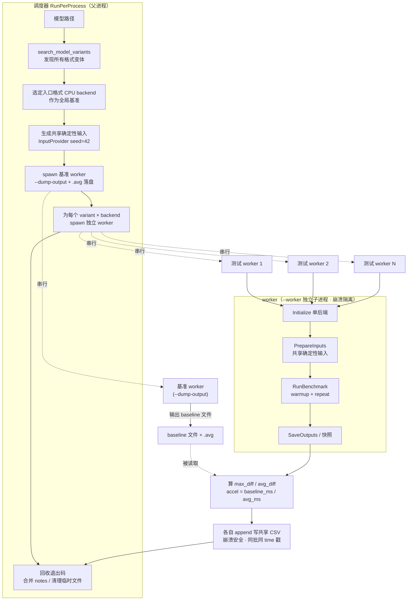

# Unified Benchmark Tool v2.0 (C++)

跨平台多框架推理基准测试工具，覆盖 **ONNX Runtime / TensorFlow Lite / LiteRT / NCNN / MNN** 五大框架，支持 **CPU / GPU / NPU / DSP** 多种加速后端。同一模型（从同一 ONNX 转换）在多个后端上运行，使用**共享确定性输入**对比推理延迟与输出精度。

> **目的**：尽可能真实地测试每一种 backend 的推理能力——不支持的 backend 直接报错标记失败（CSV 行 `avg/accel` 及内存列显示 `-`，`notes` 写原因），绝不静默降级。

---

## 1. 目录结构

```
unified_model_bench/
├── CMakeLists.txt              # 主构建脚本（VS / NDK / Ninja 通用）
├── include/                    # 公共头文件
│   ├── backend_interface.hpp   # IBackend 抽象接口 + BackendId/BackendType 枚举 + Registry
│   ├── benchmark_runner.hpp    # 基准测试编排（worker 流程 + RunPerProcess 声明）
│   ├── scheduler.hpp           # 每 backend 独立进程调度器的辅助函数声明
│   ├── csv_utils.hpp           # CSV 行级工具声明（列索引 + 行解析/回查）
│   ├── cmd_args.hpp            # CLI 参数结构
│   ├── model_format.hpp        # 模型格式枚举（ONNX/TFLite/NCNN/MNN/QNN）
│   ├── platform.hpp            # 平台宏（ARCH_STR 等）
│   └── ...                     # log / input_provider / result_collector / qnn_soc 等
├── src/                        # 实现
│   ├── main.cpp                # 入口
│   ├── benchmark_runner.cpp    # worker 编排：模型发现 → 输入生成 → 逐 backend 测试 → CSV
│   ├── scheduler.cpp           # 每 backend 独立进程调度（spawn worker + 跨进程 baseline）
│   ├── csv_utils.cpp           # CSV 行级工具（解析/列索引/worker 记录回查）
│   ├── backend_registry.cpp    # 各平台 backend 注册表
│   ├── onnx_backend.cpp        # ONNX Runtime EP（DML/OpenVINO/oneDNN/QNN/NNAPI/XNNPACK）
│   ├── tflite_backend.cpp      # TFLite Delegate（XNNPACK/NNAPI/GPU/QNN-NPU）
│   ├── litert_backend.cpp      # LiteRT（CPU/GPU/NPU，QNN dispatch）
│   ├── litert_qualcomm_stubs.cpp # Android 专用：QNN options API 的 stub 实现
│   ├── qnn_backend.cpp         # QNN SDK 原生后端（context binary，直接调 QNN C API）
│   ├── ncnn_backend.cpp        # NCNN（CPU/Vulkan，FP32/FP16/BF16）
│   ├── mnn_backend.cpp         # MNN（CPU/OpenCL/Vulkan）
│   └── ...                     # cmd_args / device_info / file_ops / input_provider / result_collector / log / qnn_soc
├── deps/                       # 第三方依赖（离线 vendored）
│   ├── onnxruntime/            # ORT 1.22.0 + DML/OpenVINO/oneDNN/QNN 各 EP 变体
│   ├── tflite/                 # TFLite 2.18.0（include + 各平台 .so/.dll）
│   ├── litert/                 # LiteRT runtime + litert_cc_sdk + NPU dispatch 库
│   ├── ncnn/                   # NCNN（桌面 + Android 头文件/库）
│   └── mnn/                    # MNN
├── tools/                      # 构建与转换脚本
│   ├── NDK_build_Android_auto.bat  # Android NDK 构建 + adb 部署 + 自动推 QNN/NCNN/TFLite/MNN/LiteRT 库
│   ├── VS_build_win_x64.bat        # Windows x64 VS 构建
│   ├── VS_build_win_x86.bat        # Windows x86 VS 构建
│   ├── onnx_convert.py             # ONNX → TFLite/NCNN/MNN 转换
│   ├── gen_test_model.py           # 生成测试模型
│   ├── csv_to_excel.py             # CSV → Excel
│   ├── config/                     # QNN HTP 离线编译配置
│   │   ├── htp_config.json             # 图/设备配置（graph_names、O:3、vtcm、hvx_threads…）
│   │   └── backend_ext_config.json     # context binary generator 后端扩展配置
│   └── utils/                      # 辅助脚本
│       ├── gen_test_data_for_onnx.py   # 生成 --input-list 测试数据与列表
│       ├── fill_htp_config.py          # 按设备 ro.soc.model 填 htp_config.json 的 soc_id/dsp_arch
│       ├── check_braces.py             # 花括号规范检查（接入 CI，见 §3.7）
│       ├── check_bat_parens.py         # bat 块内 echo 括号转义检查（接入 CI）
│       ├── csv_summary.py              # CSV 结果汇总
│       ├── analyze_bench_log.py        # 运行日志解析
│       └── probe_ncnn_blob.py          # NCNN blob 探测
├── tests/                      # doctest 单元测试（纯逻辑模块，见 §3.5）
├── .github/
│   ├── workflows/ci.yml        # GitHub Actions（Windows 全量 + Ubuntu 冒烟）
│   └── copilot-instructions.md # 编码规范
├── docs/                       # 各模块调试记录（详见 §8）
│   ├── ONNX_DEBUG_LOG.md
│   ├── ONNX_CONVERT_DEBUG_LOG.md
│   ├── TFLITE_NPU_DEBUG_LOG.md
│   ├── NCNN_DEBUG_LOG.md
│   ├── NCNN_DIFF_ANALYSIS.md
│   ├── MNN_DEBUG_LOG.md
│   ├── LiteRT_GPU_DEBUG_LOG.md
│   ├── QNN_SDK_DEBUG_LOG.md
│   ├── QNN_SDK_HTP_OPTIMIZATIONS.md
│   └── PROJECT_SCORECARD.md
└── summary.csv                 # 历史测试结果（追加式）
```

---

## 2. 支持的后端矩阵

### 2.1 BackendId 编号规则

| 范围 | 框架 | 说明 |
|------|------|------|
| 0–17 | ONNX | Execution Provider |
| 100–107 | TFLite | Delegate |
| 200–206 | NCNN | CPU/Vulkan |
| 300–309 | MNN | CPU/OpenCL/Vulkan |
| 400–405 | LiteRT | CPU/GPU/NPU |
| 500–503 | QNN SDK | HTP/GPU/CPU（context binary） |

### 2.2 各框架后端

**ONNX Runtime（0–17）**

| Backend | 名称 | 桌面 | Android | 说明 |
|---------|------|------|---------|------|
| ONNX_CPU | `ONNX_CPU` | ✅ | ✅ | 默认 CPU EP（基准） |
| ONNX_ONEDNN | `ONNX_oneDNN` | ✅ | ❌ | Intel oneDNN |
| ONNX_DML_GPU | `ONNX_DML_GPU` | ✅ | ❌ | DirectML GPU |
| ONNX_DML_NPU | `ONNX_DML_NPU` | ✅ | ❌ | DirectML NPU（V2 API） |
| ONNX_OPENVINO_CPU | `ONNX_OpenVINO_CPU` | ✅ | ❌ | OpenVINO CPU |
| ONNX_OPENVINO_GPU | `ONNX_OpenVINO_GPU` | ✅ | ❌ | OpenVINO GPU FP32 |
| ONNX_OPENVINO_GPU_FP16 | `ONNX_OpenVINO_GPU_FP16` | ✅ | ❌ | OpenVINO GPU FP16 |
| ONNX_OPENVINO_NPU | `ONNX_OpenVINO_NPU` | ✅ | ❌ | OpenVINO NPU |
| ONNX_NNAPI | `ONNX_NNAPI` | ❌ | ✅ | Android NNAPI |
| ONNX_XNNPACK | `ONNX_XNNPACK` | ❌ | ✅ | XNNPACK EP |
| ONNX_QNN_CPU / _GPU / _HTP | `ONNX_QNN_*` | ❌ | ✅ | Qualcomm QNN |

> **已删除**：`ONNX_OpenVINO_GPU_BF16`（id=8）——OpenVINO GPU 只支持 FP16/FP32/ACCURACY，BF16 在框架层面无此能力，所有硬件均不支持，故移除。
> **已删除**：`ONNX_DML_GPU_FP16`（id=3）——DML 无独立 FP16 开关，自动按硬件能力选择精度，与 `ONNX_DML_GPU` 等价，故移除。

**TFLite（100–107）**

| Backend | 名称 | 桌面 | Android | 说明 |
|---------|------|------|---------|------|
| TFLITE_CPU | `TFLITE_CPU` | ✅ | ✅ | 默认（基准） |
| TFLITE_XNNPACK | `TFLITE_XNNPACK` | ✅ | ✅ | XNNPACK delegate |
| TFLITE_XNNPACK_FP16 | `TFLITE_XNNPACK_FP16` | ✅* | ✅ | FP16（桌面需硬件支持） |
| TFLITE_NNAPI | `TFLITE_NNAPI` | ❌ | ✅ | NNAPI |
| TFLITE_GPU / _FP16 | `TFLITE_GPU` | ❌ | ✅ | GPU delegate |
| TFLITE_NPU | `TFLITE_NPU` | ❌ | ✅ | QNN HTP delegate |

**LiteRT（400–405）**

| Backend | 名称 | 桌面 | Android | 说明 |
|---------|------|------|---------|------|
| LITERT_CPU | `LiteRT_CPU` | ✅ | ✅ | LiteRT CPU（基准） |
| LITERT_GPU | `LiteRT_GPU` | ✅ | ✅ | WebGPU/D3D12（桌面）/ CL/GL（Android） |
| LITERT_GPU_FP16 | `LiteRT_GPU_FP16` | ✅ | ✅ | GPU FP16 |
| LITERT_NPU | `LiteRT_NPU` | ❌ | ✅ | Qualcomm HTP（dispatch） |
| LITERT_NPU_FP16 | `LiteRT_NPU_FP16` | ❌ | ✅ | HTP FP16 |

**NCNN（200–206）**

| Backend | 名称 | 桌面 | Android | 说明 |
|---------|------|------|---------|------|
| NCNN_CPU | `NCNN_CPU` | ✅ | ✅ | CPU（基准） |
| NCNN_CPU_FP16 | `NCNN_CPU_FP16` | ✅ | ✅ | CPU FP16（NEON） |
| NCNN_CPU_BF16 | `NCNN_CPU_BF16` | ✅* | ✅* | CPU BF16（需 CPUID 支持 + trial 验证） |
| NCNN_VK / _FP16 / _BF16 | `NCNN_VK` / `NCNN_VK_FP16` / `NCNN_VK_BF16` | ✅ | ❌* | Vulkan（Android NCNN 编译时无 Vulkan，报错不降级） |

> **命名注意**：枚举常量名为 `NCNN_VK*`（`NCNN_VULKAN` 是 NCNN 库自身的平台检测宏，
> 与本工具的 backend 名冲突，故改名）。`--backend` 走**精确匹配**（不区分大小写），
> 写 `NCNN_Vulkan` 会被判为未知名称并跳过。

**MNN（300–309）**

| Backend | 名称 | 桌面 | Android | 说明 |
|---------|------|:----:|:-------:|------|
| MNN_CPU | `MNN_CPU` | ✅ | ✅ | CPU（基准） |
| MNN_OpenCL | `MNN_OpenCL` | ✅ | ✅ | OpenCL FP32 |
| MNN_OpenCL_FP16 | `MNN_OpenCL_FP16` | ✅ | ✅ | OpenCL FP16 |
| MNN_OpenCL_BF16 | `MNN_OpenCL_BF16` | ⚠️ | ⚠️ | OpenCL BF16（详见下） |
| MNN_VULKAN / _FP16 / _BF16 | `MNN_VULKAN*` | ⚠️ | ⚠️ | Vulkan（需驱动支持，否则报错） |
| MNN_OPENGL | `MNN_OPENGL` | ⚠️ | ⚠️ | OpenGL |
| MNN_NN | `MNN_NN` | ⚠️ | ⚠️ | NNAPI / CoreML |

> **MNN 无静默降级（2026-08-29 起）**：`ScheduleConfig::backupType` 默认为
> `MNN_FORWARD_CPU`，MNN 会在请求后端不可用时**自动退到 CPU** 且 `createSession()`
> 仍返回成功——此前这导致 6 个后端挂着 GPU 名字输出 CPU 的数字（输出与 `MNN_CPU`
> 逐位相同，可据此识别）。现已设置 `backupType = type` 并加
> `VerifyActualForwardType()` 校验：不可用即报错，CSV 打 `-`。详见
> `docs/MNN_DEBUG_LOG.md` §2。
>
> 因此上表 ⚠️ 项**依赖实际环境**：在 Intel Iris Xe 的 Windows 桌面上，Vulkan /
> OpenGL / NN 均不可用（报 `createSession failed - requested backend unavailable`），
> 只有 CPU + OpenCL 能跑。请以实测 CSV 为准，不要假定设备一定支持。

**QNN SDK（500–503，Android）**

| Backend | 名称 | 桌面 | Android | 说明 |
|---------|------|------|---------|------|
| QNN_HTP | `QNN_HTP` | ❌ | ✅ | 直接加载 context binary 到 Hexagon（零拷贝共享内存） |
| QNN_GPU | `QNN_GPU` | ❌ | ✅ | 同一 context binary 在 Adreno GPU 执行 |
| QNN_CPU | `QNN_CPU` | ❌ | ✅ | 同一 context binary 在 CPU 执行 |

> 模型格式为 **QNN context binary**（`.dlc`/`.serialized.bin`/`.bin`/`.so`），由 `qnn-context-binary-generator` 从 DLC 离线生成。仅 Android 且 `HAVE_QNN_SDK_BACKEND=ON` 时编译。
### 2.3 平台可用性：以代码为准

上表的"桌面/Android"列**由 `BackendConfig::platforms` 位掩码决定**（`PlatformMask`
枚举，见 `include/backend_interface.hpp`），不再是散落在 `InitDefaults()` 里的
`#if` 分支。因此：

- 新增后端在 `cmake/backends.cmake` 风格的声明表里**写一行** `platforms` 即可
- 运行时可用 `platform_supports(mask)` / `platform_mask_str(mask)` 查询，
  无需人工维护本表
- `--log-level 1` 启动时会打印每个已注册 backend 的可用平台，可用于核对本表
- 未实现后端（如 `ONNX_CUDA` / `ONNX_TENSORRT` 占位枚举）的 `platforms` 为
  `kPlatNone`，任何平台都不会注册

> 编译期开关（`HAVE_*_BACKEND`）仍叠加在掩码之上：掩码决定"该平台是否**应该**有"，
> 宏决定"这次构建是否**编进去了**"。两者都为真才会注册。
---

## 3. 构建系统

### 3.1 依赖与版本

| 依赖 | 版本 | Windows 路径 | Android 路径 | Linux 路径 |
|------|------|--------------|--------------|------------|
| ONNX Runtime | 1.22.0 | `deps/onnxruntime/lib/win-x64/{cpu,dml,onednn,openvino}/` | `deps/onnxruntime/lib/android/arm64-v8a/` | `deps/onnxruntime/lib/linux-x64/` |
| TensorFlow Lite | 2.18.0 | `deps/tflite/lib/win-x64/tensorflowlite_c.dll` | `deps/tflite/lib/android/arm64-v8a/*.so` | — |
| LiteRT | — | `deps/litert/liteRT_runtime/windows_x86_64/` | `deps/litert/liteRT_runtime/android_arm64/` | — |
| NCNN | 1.0.x | `deps/ncnn/lib/win-x64/ncnn.dll` | `deps/ncnn/lib/android/arm64-v8a/libncnn.so` | `deps/ncnn/lib/linux-x64/libncnn.a` + glslang 静态库 |
| MNN | — | `deps/mnn/lib/win-x64/MNN.dll` | `deps/mnn/lib/arm64-v8a/libMNN.so` | — |
| QNN SDK | 2.48.40.260702 | — | `C:\Qualcomm\AIStack\QAIRT\2.48.40.260702` | — |

> `deps/` 被 `.gitignore` 排除（体积大，需手动拷贝或按脚本获取），因此 **CI 上默认不
> 存在**——这也是 CI 的 Ubuntu job 只做"编译冒烟"而非真机推理的原因（见 §3.6）。
> Linux 桌面 NCNN 用官方 Ubuntu 预编译静态库，链接时需 `libgomp` + 附带的 glslang
> 静态库（已在 `CMakeLists.txt` 中处理）。

### 3.2 CMake 选项

| 选项 | 默认 | 说明 |
|------|------|------|
| `HAVE_ONNX_BACKEND` | ON | ONNX Runtime |
| `HAVE_TFLITE_BACKEND` | OFF | TFLite |
| `HAVE_NCNN_BACKEND` | ON | NCNN |
| `HAVE_MNN_BACKEND` | OFF | MNN |
| `HAVE_LITERT_BACKEND` | OFF | LiteRT |
| `HAVE_QNN_SDK_BACKEND` | OFF | 原生 QNN SDK 后端（仅 Android） |
| `QNN_SDK_ROOT` | — | QNN SDK 路径（Android） |
| `BUILD_TESTING` | ON | 构建 doctest 单元测试（`unified_bench_tests` + ctest） |

### 3.3 Windows x64 构建

```bat
tools\VS_build_win_x64.bat
:: 或手动：
cmake -B build/win-x64 -DHAVE_TFLITE_BACKEND=ON -DHAVE_LITERT_BACKEND=ON -DHAVE_ONNX_BACKEND=ON -DHAVE_NCNN_BACKEND=ON
cmake --build build/win-x64 --config Debug
```

Windows x86 用 `tools\VS_build_win_x86.bat`（注意：x86 下 ONNX 仅注册 CPU/DML_GPU/DML_NPU，
oneDNN 与 OpenVINO 无 32 位库）。

### 3.3b Linux 桌面构建

Linux 桌面已支持 **ONNX Runtime + NCNN** 两个后端（`ARCH_DIR=linux-x64`），产物为
`build/linux-x64/unified_bench`：

```bash
# 依赖：cmake >= 3.16、g++/clang（C++17）、libgomp（NCNN 静态库需要）
cmake -S . -B build/linux-x64 \
  -DHAVE_ONNX_BACKEND=ON \
  -DHAVE_NCNN_BACKEND=ON
cmake --build build/linux-x64 -j"$(nproc)"

# 运行前把 ONNX Runtime 的 .so 加入搜索路径
LD_LIBRARY_PATH=deps/onnxruntime/lib/linux-x64 ./build/linux-x64/unified_bench test_model.onnx --repeat 10
```

**前置条件**：`deps/onnxruntime/lib/linux-x64/libonnxruntime.so` 与
`deps/ncnn/lib/linux-x64/libncnn.a`（含 glslang 静态库）需自行放置——`deps/` 不入库。
其余后端（TFLite / MNN / LiteRT / QNN SDK）在 Linux 桌面**尚未接入**（无对应
linux-x64 预编译库与链接规则）。

### 3.4 Android NDK 构建 + 部署

```bat
set ANDROID_NDK_ROOT=C:\Users\...\Android\Sdk\ndk\27.0.12077973
tools\NDK_build_Android_auto.bat
```

脚本自动完成：配置 → 编译 → `adb push` 可执行文件与全部 `.so` → 按 `ro.soc.model` 自动选 Hexagon 版本并推送 Stub/Skel → 运行基准 → 回拉 CSV。

**增量推送**：模型文件与第三方 `.so` 若设备上**已存在则跳过**（避免每次重复传输大文件）。
需要强制覆盖时用 `--force-push`：

```bat
tools\NDK_build_Android_auto.bat --model "C:\...\model.onnx" --force-push
```

> 注意：本地**重新生成**了同名模型（如重新导出 `test_model.onnx`）时，设备上的旧文件
> 不会被自动替换，必须加 `--force-push`。

**编写构建脚本时注意 cmd 的括号陷阱**：在 `if (...)` / `for (...) do (...)` **块内**，
`echo` 行里未转义的括号会被当成块语法解析，导致整个脚本在**解析阶段**就崩：

```bat
if "%FORCE_PUSH%"=="1" (
    echo Pushing custom model (forced)...   :: 错！`)` 提前闭合块，`...` 被当命令
    echo Pushing custom model ^(forced^)... :: 对，用 ^ 转义（或加引号）
)
```

报错为 `此时不应有 ...。` / `... was unexpected at this time.`，且**即便该分支未进入
也会触发**（cmd 按块整体解析）。`REM` / `::` / `title` 行内的括号是安全的，只有 `echo`
受影响。仓库用 `python tools/utils/check_bat_parens.py` 做静态拦截（已接入 CI）。

### 3.5 单元测试

纯逻辑模块（不依赖任何推理框架与 `deps/`）由 **doctest** 单测守护，可在**任意平台**
离线运行：

```bash
cmake -S . -B build -DBUILD_TESTING=ON
cmake --build build
ctest --test-dir build --output-on-failure      # 或直接跑 ./build/unified_bench_tests
```

| 测试文件 | 覆盖模块 |
|---|---|
| `tests/test_csv_utils.cpp` | CSV 行解析/引用、按 backend 名精确回查、notes 合并 |
| `tests/test_scheduler.cpp` | backend 过滤（白/黑名单）、QNN context binary 后端筛选 |
| `tests/test_cmd_args.cpp` | CLI 解析（`--backend`、`--threads` 下界等） |
| `tests/test_model_loader.cpp` | 模型变体发现、`estimate_weight_mb`（ONNX/NCNN/TFLite 精确统计） |
| `tests/test_input_provider.cpp` | 确定性输入生成（seed 一致性） |
| `tests/test_result_collector.cpp` | CSV schema、失败哨兵 `-1` / 无基准哨兵 `-2` |

设计要点：测试目标通过 `-U HAVE_*_BACKEND` **取消所有后端宏**，以"空注册表"编译
被测单元，从而不链接任何第三方库（见 `CMakeLists.txt` 的 `BUILD_TESTING` 块）。
其中 3 个依赖真实模型的用例仅在仓库存在 `test_model.onnx` 时编译（CI 上自动跳过）。

### 3.6 持续集成（GitHub Actions）

`.github/workflows/ci.yml` 在 push/PR 到 `main` 时触发，两个 job：

| Job | 平台 | 内容 |
|---|---|---|
| `build-windows` | `windows-latest` | 全量构建（ONNX + NCNN）+ `ctest` + 花括号规范检查 + bat 括号检查 |
| `build-ubuntu` | `ubuntu-latest` | **纯逻辑模块编译冒烟**：所有 `HAVE_*_BACKEND=OFF`，仍编译 7 个测试源文件并跑 ctest |

Ubuntu job 刻意关掉全部后端：`deps/` 不入 git，CI 镜像没有预编译库。即便如此仍能
守住 Linux 专有编译问题（典型如 glibc `clock_gettime`/`CLOCK_MONOTONIC` 可见性）。
真机推理（ONNX/NCNN/QNN）仍在本地验证。

### 3.7 代码规范检查

> 完整编码约定见 `.github/copilot-instructions.md`（Copilot 会自动加载该文件）。

```bash
python tools/utils/check_braces.py        # 无参 = 扫 src/ 与 include/
python tools/utils/check_bat_parens.py    # 无参 = 扫仓库根下 .bat/.cmd
```

`check_braces.py` 强制所有 `if/else/for/while/do/switch/case` 带花括号。
`check_bat_parens.py` 拦截 bat 块内 `echo` 行未转义的括号（详见 §3.4 的
"cmd 括号陷阱"）。两者退出码语义一致：`0`=合规、`1`=有违规、`2`=**扫描未完成**
（路径不存在 / 一个文件都没扫到 / 读取失败）。**只有 0 才算通过**——历史上
`check_braces.py` 默认路径硬编码到不存在的目录，长期打印 `TOTAL: 0` 却零文件扫描，
属假绿灯，现已修复并接入 CI。

### 3.8 新增后端：改哪里

后端相关的构建配置集中在 `cmake/backends.cmake` 的**一张表**里（此前分散在
`CMakeLists.txt` 的 6 处）。新增一个后端只需：

1. `include/backend_interface.hpp` — `BackendId` 枚举 + `is_xxx_backend()` 范围函数
2. `src/xxx_backend.cpp` — 实现 `IBackend` + `CreateXxxBackend` 工厂
3. `src/backend_registry.cpp` — `extern` 声明（`#ifdef` 包裹）+ `InitDefaults()` 注册
4. `cmake/backends.cmake` — 加一条 `ub_row(XXX ...)`（含 SOURCES / DEFINITION /
   各平台 LIBS / Windows DLLS）
5. `README.md` — §2 后端矩阵表

`cmake/backends.cmake` 分两阶段执行，这是必需的：`add_definitions()` /
`include_directories()` 是**目录作用域**，必须在 `add_executable()` **之前**调用；
而 `target_link_libraries()` / `add_custom_command(POST_BUILD)` 需要目标**已存在**。
故 `CMakeLists.txt` 中 `ub_backends_phase1(UB_BACKEND_SOURCES)` 在前、
`ub_backends_phase2()` 在后。

> **重构安全性**：该表是纯重构，解析后的构建配置与原内联代码逐项一致。验证方式：
> ```bash
> cmake -S . -B build/a -DUB_DUMP_BUILD_CONFIG=ON [选项...] > before.txt
> cmake -S . -B build/b -DUB_DUMP_BUILD_CONFIG=ON [选项...] > after.txt
> diff before.txt after.txt      # 应仅有耗时/目录名差异
> ```
> `cmake/dump_config.cmake` 会打印目标解析后的 SOURCES / INCLUDE_DIRECTORIES /
> COMPILE_DEFINITIONS / LINK_LIBRARIES 以及目录级属性与 POST_BUILD DLL 清单。
> 改动后端表后请跑一次对比，确认没有意外改变构建结果。

> 例外项（有意留在 `CMakeLists.txt` 内联，不进表）：
> - `deps/onnxruntime/include`：**无条件**加入（与 `HAVE_ONNX_BACKEND` 无关，历史行为）
> - QNN TFLite delegate 库：TFLite 后端的附加条件库，非主链接行
> - LiteRT 的 DXC 探测：Windows SDK 版本搜索 + fallback 链，不是简单的库清单

---

## 4. CLI 用法

```
unified_bench <model_path> [选项]

选项：
  --model <path>       模型路径（也支持位置参数）
  --input-list <path>  输入列表文件（见下），由 tools/utils/gen_test_data_for_onnx.py 生成
  --input-format <fmt> 输入数据格式：auto|float32|uint8（默认 auto，按文件大小探测）
  --backend <name,...> 指定 backend（逗号分隔，缺省=全部可用）
  --no-backend <name,...> 排除 backend（黑名单，可与 --backend 组合，先白名单后排除）
  --repeat <N>         推理次数（默认 100）
  --warmup <N>         预热次数（默认 1）
  --threads <N>        线程数（默认 4）
  --csv <path>         CSV 输出路径（默认 summary.csv）
  --log-level <0-4>    日志级别（0=OFF..4=ERR，默认 2=INFO）
  --output-dir <path>  输出目录（存放基准临时文件）
  --no-csv             不写 CSV
  --help / --version
```

### 运行模式：每 backend 独立进程（唯一模式）

工具**只有一种运行模式**——调度器为每个（模型变体 × backend）启动一个**独立子进程（worker）**
执行单后端测试，无同进程顺序跑：

- **内存测量干净**：每个 worker 是全新进程，`peak_mem_mb` / `resident_mem_mb` 不含其他框架的
  残留（同进程顺序跑时前面 backend 的页会污染后面的读数，这正是采用本架构的原因）
- **崩溃隔离**：某个 backend 崩溃（如 ncnn Vulkan 在部分驱动上的析构崩溃）只影响自己的 worker，
  其余 backend 照常出结果；异常退出码合并进该行 `notes` 列
- **同批同时间戳**：同一调度器运行产生的所有 CSV 行共享同一个 `time` 值
- **全局基准**：以**入口模型格式的 CPU backend** 为精度基准（`test_model.onnx`→ONNX_CPU、
  `test_model.ncnn.bin`/`.ncnn.param`→NCNN_CPU、`test_model.mnn`→MNN_CPU，以此类推），其输出
  dump 给所有其他 worker 做 diff/accel 对比；**基准行本身 diff/accel 显示 `-`**

```bash
# 直接运行即调度全部可用 backend（每个一个独立进程）
unified_bench.exe test_model.onnx --repeat 10 --warmup 1

# 限制范围（仍每 backend 独立进程）
unified_bench.exe test_model.ncnn.bin --backend NCNN_CPU,NCNN_CPU_BF16 --repeat 10
```

### 使用外部输入（--input-list）

通过 `tools/utils/gen_test_data_for_onnx.py` 生成模型测试数据与输入列表：

```bash
# 交互式（无参运行会提示输入模型路径）
python tools/utils/gen_test_data_for_onnx.py
#   或直接用函数：
python -c "import sys; sys.path.insert(0,'tools/utils'); \
  from gen_test_data_for_onnx import generate_test_data; \
  generate_test_data('test_model.onnx','data','relative',gen_uint8=True)"
```

> 依赖 `numpy` + `onnxruntime`（pip 安装，见 `requirements.txt`）。

生成的 `input_list_<model>_float32.txt` 格式（每行一个 .bin，`#` 为注释）：

```
# float32 inputs for test_model (2 input(s))
# one input .bin file per line (relative to this file's dir):

input_data_test_model_float32/input_a_1x3x224x224.bin
input_data_test_model_float32/input_b_1x48x1x1.bin
```

运行基准时通过 `--input-list` 加载（**路径按列表文件所在目录解析**，可从任意工作目录运行）：

```bash
# float32（auto 自动探测）
unified_bench test_model.onnx --input-list data/input_list_test_model_float32.txt

# uint8（auto 探测，或显式指定）
unified_bench test_model.onnx --input-list data/input_list_test_model_uint8.txt --input-format uint8
```

- **auto 探测**：文件大小 = 元素数×4 → float32；= 元素数 → uint8（uint8 按 /255 归一化到 float）
- **格式不匹配** / 文件缺失 / 输入数量不符 → 直接报错并跳过该变体，不静默兜底
- 输入数据对**所有 backend 共享**，保证公平对比

### 示例

```bash
# 桌面：全后端
unified_bench.exe test_model.onnx --repeat 10 --warmup 1

# 桌面：指定 TFLite 后端
unified_bench.exe test_model.tflite --backend TFLITE_CPU,TFLITE_XNNPACK --repeat 10

# Android：QNN HTP（ONNX）与 TFLite NPU 对比
adb shell "cd /data/local/tmp/bench_test && LD_LIBRARY_PATH=.:./qnn ADSP_LIBRARY_PATH=./qnn \
  ./unified_bench test_model.onnx --backend ONNX_QNN_HTP,TFLITE_NPU --repeat 10"

# Android：LiteRT NPU
adb shell "cd /data/local/tmp/bench_test && LD_LIBRARY_PATH=.:./qnn ADSP_LIBRARY_PATH=./qnn \
  ./unified_bench test_model.onnx --backend litert_npu --repeat 1 --warmup 0"
```

### backend 命名（不区分大小写，**精确匹配**）

`--backend` / `--no-backend` 通过 `BackendRegistry::FindByName()` 做**整串精确匹配**
（仅忽略大小写），不是子串匹配——写错一个字符就会被判为未知名称并跳过
（`LOGW: Unknown backend name: xxx`）。可用名称以 `src/backend_registry.cpp` 的
注册为准：

| 框架 | 名称 |
|------|------|
| ONNX | `ONNX_CPU`, `ONNX_oneDNN`, `ONNX_DML_GPU`, `ONNX_DML_NPU`, `ONNX_OpenVINO_CPU`, `ONNX_OpenVINO_GPU`, `ONNX_OpenVINO_GPU_FP16`, `ONNX_OpenVINO_NPU`, `ONNX_NNAPI`, `ONNX_XNNPACK`, `ONNX_QNN_CPU`, `ONNX_QNN_GPU`, `ONNX_QNN_HTP` |
| TFLite | `TFLITE_CPU`, `TFLITE_XNNPACK`, `TFLITE_XNNPACK_FP16`, `TFLITE_NNAPI`, `TFLITE_GPU`, `TFLITE_GPU_FP16`, `TFLITE_NPU` |
| LiteRT | `LiteRT_CPU`, `LiteRT_GPU`, `LiteRT_GPU_FP16`, `LiteRT_NPU`, `LiteRT_NPU_FP16` |
| NCNN | `NCNN_CPU`, `NCNN_CPU_FP16`, `NCNN_CPU_BF16`, `NCNN_VK`, `NCNN_VK_FP16`, `NCNN_VK_BF16` |
| MNN | `MNN_CPU`, `MNN_OpenCL`, `MNN_OpenCL_FP16`, `MNN_OpenCL_BF16`, `MNN_VULKAN`, `MNN_VULKAN_FP16`, `MNN_VULKAN_BF16`, `MNN_OPENGL`, `MNN_NN` |
| QNN SDK | `QNN_SDK_CPU`, `QNN_SDK_GPU`, `QNN_SDK_HTP` |

> 注意大小写不敏感，故 `ncnn_vk`、`onnx_qnn_htp`、`litert_npu` 同样有效。
> 各平台上实际注册的子集见 §2（`FindByName` 只认已注册的条目，未编译/非本平台的
> 后端同样报未知名称）。

---

## 5. 架构设计

### 5.1 核心流程（`benchmark_runner.cpp`）



- **调度器**（`RunPerProcess`，非 worker 进程）：发现模型变体 → 先跑入口格式 CPU baseline worker
  （`--dump-output` 把输出与 avg 落盘）→ 再为每个 (variant × backend) spawn 一个 worker
  （`--worker --backend <name> --batch-time <t>`，带 `--baseline-file`/`--baseline-ms` 做跨进程对比）
- **worker**（`--worker` 标记的子进程）：普通单后端流程（`TestVariant`→`TestBackend`），
  写共享 CSV（append），日志直通终端；父进程按退出码区分：`0`=成功、`1`=预期失败（worker 已自写
  失败行）、其他=异常崩溃（退出码合并进该行 `notes`）
- 每个 variant 跑完后调度器删除 baseline 临时文件（`<base>_<backend>.out` + `.avg`）

> **worker 是严格串行的，不是并行的**（`spawn_process()` 内部
> `WaitForSingleObject(..., INFINITE)` / `waitpid()` 阻塞等待子进程结束，
> 再由 `RunPerProcess()` 循环 spawn 下一个）。这是有意的取舍：
>
> | | 串行（当前） | 并行 |
> |---|---|---|
> | 内存测量 | ✅ 独占机器，`peak_mem_mb`/`resident_mem_mb` 干净可比 | ❌ 多进程同时驻留，读数互相污染 |
> | 延迟测量 | ✅ 独占 CPU/GPU/NPU，`avg_run_ms` 不受争用影响 | ❌ 多后端抢同一 NPU/GPU，测的是争用下的吞吐而非单后端延迟 |
> | 崩溃隔离 | ✅ 保持 | ✅ 保持 |
> | 总耗时 | ❌ 各后端耗时**累加** | ✅ 取最大值 |
>
> 本工具的产出是"每后端的部署级指标"（延迟、内存、精度），**测量可信度优先于
> 跑批速度**，故选串行。代价是总墙钟时间 = Σ(每后端 warmup+repeat 耗时 + 进程启动开销)；
> backend 多、repeat 大时（如 `--repeat 1000` 跑 10 个后端）会明显偏慢，属预期行为。
> 若只关心快速冒烟，用 `--backend` 限定范围 + 小 `--repeat`。

### 5.2 后端抽象（`backend_interface.hpp`）

所有 backend 实现同一 `IBackend` 接口，通过 `BackendRegistry` 注册与工厂创建：

```
IBackend
├── Initialize(model_path, num_threads)
├── QueryIOInfo(input_shape, output_shape)
├── SetSharedInput / PrepareInputs
├── RunBenchmark(warmup, repeat, ...)
├── GetTiming(...)
└── SaveOutputs(...)
```

### 5.3 共享输入机制

- 所有 backend 使用**同一份确定性输入**（`InputProvider`，seed=42）保证公平对比
- per-process 模式下每个 worker 是独立进程，各自用**相同 seed** 生成数值完全一致的输入
  （无进程间内存共享，但数据相同）
- 临时 CPU backend 先查询模型 IO shape → 解析成元素个数 → 生成输入
- 各 backend 内部处理自己的布局需求（TFLite NCHW→NHWC 转置、NCNN [N,C,H,W]→[w,h,c] 等）

### 5.4 失败语义

- **初始化失败**（backend 不可用、精度不支持等）→ CSV 行 `avg/accel` 及内存 4 列均显示 `-`，
  `notes` 列写具体原因（`last_error_`，如 "DML_NPU append: No devices detected"），不崩溃
- **worker 崩溃**（进程非零退出，如 0xC0000409）→ 数据已写则把退出码合并进该行 `notes`
  （`worker process exited abnormally with code ...`）；仅在崩溃发生在写记录**之前**才补独立失败行
- **不支持即报错**，绝不静默降级（NCNN BF16 无指令 → 报错；Vulkan 无设备 → 报错；FP16 权重缺失 → 报错）
- 模型类型不匹配提前拦截：输入非 FLOAT（如 int64 的 `input_ids`）或含动态维（`-1`）时，
  `QueryIOMetadata` 给出明确原因并标记失败（本工具基准为 float32，不做 int64/动态 shape 支持）

### 5.5 CSV 输出与内存测量

CSV 共 29 列：模型信息（`model_name` → `output_elements`）之后紧跟 `weight_mem_mb`，
然后是运行配置与 timing/精度列（`warmup_runs` → `acceleration_vs_cpu`），
内存实测列（`peak_mem_mb` / `resident_mem_mb`）与元数据（`backend_name` → `notes`）收尾。
部署侧关键列：

| 列 | 含义 |
|----|------|
| `transfer_in_ms` | 每轮平均 **H2D 输入搬运**（host→device upload），avg ms/repeat |
| `transfer_out_ms` | 每轮平均 **D2H 输出搬运**（device→host download + 快照 memcpy），avg ms/repeat |
| `transfer_total_ms` | `transfer_in_ms + transfer_out_ms` |
| `max_output_diff` / `avg_output_diff` | 与基准输出逐元素差异（`max\|a-b\|` / `avg\|a-b\|`） |
| `acceleration_vs_cpu` | 基准 avg / 本 backend avg（`baseline_ms / avg_ms`）；无基准时 `-` |
| `weight_mem_mb` | 模型权重内存（ONNX 解析 initializer / NCNN 取 `.ncnn.bin` 大小 / TFLite 解析 flatbuffer Buffer 精确统计 / MNN·QNN 按文件大小近似），与 backend 无关 |
| `peak_mem_mb` | 进程峰值工作集（Windows `PeakWorkingSetSize` / Linux `VmHWM`），单调递增 |
| `resident_mem_mb` | run 结束后的常驻工作集（`WorkingSetSize` / `VmRSS`） |
| `notes` | 初始化耗时明细（`load_lib=` 等）、失败原因、worker 异常退出码等 |

> **`notes` 不再重复 `t_in=`/`t_out=`**：搬运时间已有独立的
> `transfer_in_ms` / `transfer_out_ms` / `transfer_total_ms` 列（6 位小数），
> notes 里的 3 位小数摘要属冗余，已于 2026-08-29 移除。

**搬运时间语义**（各 backend 差异，见 `IBackend::GetTransferTiming()`）：
- **统一语义**：`avg_run_ms` 为**纯推理时间**（不含显式 H2D 输入上传与 D2H 输出下载；
  显式搬运分别计入 `transfer_in_ms` / `transfer_out_ms`）。
- **MNN / TFLite / LiteRT / QNN SDK**：有显式 upload/download 步骤，
  `transfer_in`/`transfer_out` 实测搬运调用，且均**在 avg 计时之外**。
  （**MNN 注意**：设备后端的 `runSession()` 是异步提交，同步点为 `copyToHostTensor()`。
  本工具把该同步**放在 `avg_run_ms` 计时窗口内**，否则 avg 会退化成"命令提交延迟"、
  而真实 GPU 时间会混入 `transfer_out`。详见 `docs/MNN_DEBUG_LOG.md` §3。）
- **NCNN**：`extract()` 即同步推理（含内部 D2H），无法拆分 → `avg_run_ms` 含 D2H；
  `transfer_out` 仅统计 extract 后的快照 memcpy。
- **ONNX**：输入为 `CreateTensorWithDataAsOrtValue` **零拷贝 wrap**（无独立 H2D），
  `transfer_in` 保持 0；`transfer_out` 为 Run 后快照 memcpy。
- **CPU backend**：`transfer_in`/`transfer_out` 接近 0（仅 memcpy，如 30 输出模型 ~1ms）。

**注意**：GPU backend 的同步推理调用（ONNX `OrtRun`、TFLite `Invoke`、LiteRT
`RunCompiledModel`）在返回时数据已在 CPU，`avg_run_ms` 隐含包含设备端搬运；
MNN GPU 的 `runSession` 是异步提交，D2H 全部落在 `transfer_out`。因此
跨后端对比 `avg_run_ms` 时，应结合 `transfer_*` 列判断"纯计算 vs 搬运"占比。

测量语义：`peak`/`resident` 是**进程级**统计（含框架运行时/arena 开销，不含 GPU 显存）；
per-process 架构下每 backend 独占进程，读数即该 backend 的部署值，无跨 backend 污染。
失败行内存列与 `avg/accel` 一致显示 `-`。

---

## 6. 平台适配要点（详见各 backend 调试文档）

跨平台编译/运行中的具体踩坑与修复细节（符号冲突、宏名冲突、硬件能力硬失败、DXC 版本、QNN 库版本匹配等）已记录在对应的后端调试文档中，README 仅保留架构性结论：

| 适配点 | 结论 | 详细记录 |
|------|------|---------|
| Windows：TFLite + LiteRT 符号共存 | 不链 `tensorflowlite_c.dll.if.lib`，仅 XNNPACK delegate 动态加载；两者可同时 `ON` | `docs/TFLITE_NPU_DEBUG_LOG.md` |
| Android：NCNN Vulkan 宏冲突 | 枚举改名 `NCNN_VK`（`NCNN_VULKAN` 宏保留作平台检测）；无 Vulkan 时初始化报错而非降级 | `docs/NCNN_DEBUG_LOG.md` |
| Android：NCNN BF16/FP16 硬失败 | 指令/权重不支持时直接 `return false`，绝不静默降级 | `docs/NCNN_DEBUG_LOG.md` |
| Windows：LiteRT GPU 需新版 DXC | CMake post-build 自动复制 Windows SDK 新版 `dxcompiler.dll`/`dxil.dll` | `docs/LiteRT_GPU_DEBUG_LOG.md` |
| Android：QNN 版本严格匹配 | Stub/Skel 同 SDK；定制 ORT-QNN 构建；dispatch 与设备库版本一致 | `docs/TFLITE_NPU_DEBUG_LOG.md`、`docs/QNN_SDK_DEBUG_LOG.md` |
| 调度器 worker 命令行重建 | `--repeat 2` 等**空格写法**的值曾被误判为位置参数顶替模型路径（worker 报 "No model variants found"）；现由 `takes_value_arg()` 识别全部带值选项并原样透传（2026-08-29 修复，见 §5.1） | `src/scheduler.cpp`、`tests/test_scheduler.cpp` |

> **注意（2026-08-29 修复前的行为）**：由于上述命令行重建缺陷，`--repeat N`、
> `--warmup N`、`--threads N` 等**空格写法**在调度器模式下会把数值当成模型路径传给
> worker，导致该 backend 直接失败。当时只有 `--opt=value` 等号写法能正常工作，
> 而 README 与 `--help` 给出的示例恰恰都是空格写法。现已修复并有回归测试守护。

---

## 7. QNN 集成细节

### 7.1 TFLITE_NPU（QNN TFLite Delegate）

- 通过 `dlopen("libQnnTFLiteDelegate.so")` 动态加载（**无需 LD_PRELOAD**）
- `backend_type` 必须显式设 `kHtpBackend`（默认是 `kUndefinedBackend`）
- ARM64 上通过 dlsym 调用返回 struct 的函数，须声明为 >16 字节（触发 hidden-pointer ABI，x8 传递）
- 详见 `docs/TFLITE_NPU_DEBUG_LOG.md`

### 7.2 LiteRT_NPU（Qualcomm dispatch）

- `LiteRtCreateEnvironment` 传 `kLiteRtEnvOptionTagDispatchLibraryDir` = `/data/local/tmp/bench_test/qnn`
- 需配置 `LrtQualcommOptions`（backend=HTP、performance=burst、optimization=O3）并 attach 到编译选项，否则 dispatch 报 "Null Qualcomm options"
- Android `libLiteRt.so` 不导出 `Lrt*QualcommOptions*` API → 由 `litert_qualcomm_stubs.cpp` 提供 stub（序列化为 TOML payload）
- **已知问题**：设备上 QNN 库（2.37.0/5.48.0）与 dispatch 期望（2.36.0/5.47.0）不匹配时 `CreateCompiledModel` 返回 **504**，需匹配版本的 QNN 库

### 7.3 ONNX QNN EP

- 使用含 QNN EP 的定制 `libonnxruntime.so`（`deps/onnxruntime/lib/android/qnn/`）
- HTP 完整配置：`backend_type=htp`、`htp_performance_mode=burst`、`htp_graph_finalization_optimization_mode=3`、`enable_htp_fp16_precision=1` 等
- 支持 EP Context 缓存：首次编译生成 `*_epContext.onnx`，后续复用（`kOrtSessionOptionsDisableModelCompile`）

### 7.4 设备端 QNN 目录布局

```
/data/local/tmp/bench_test/qnn/
├── libQnnTFLiteDelegate.so      # TFLite NPU delegate
├── libLiteRtDispatch_Qualcomm.so # LiteRT NPU dispatch（SoC 对应版本）
├── libQnnHtp.so / libQnnSystem.so / libQnnHtpPrepare.so / libQnnSaver.so / libQnnCpu.so / libQnnGpu.so
├── libQnnHtpV73Stub.so / CalculatorStub.so   # 必须与 Skel 同 SDK
├── libQnnHtpV73Skel.so          # Hexagon DSP 固件（与 Stub 同 SDK）
├── libc++.so.1 / libc++abi.so.1 # Hexagon C++ 运行时（v73/G0/pic）
└── (qtld-net-run)               # QNN 官方验证工具
```

### 7.5 QNN_SDK（原生 QNN C API backend）

- 模型格式：**QNN context binary**（`.dlc`/`.serialized.bin`/`.bin`/`.so`），由 `qnn-context-binary-generator` 从 DLC 离线生成；检测到上述后缀自动路由到 QNN SDK backend
- 执行流程（仿 `SampleAppSharedBuffer`）：`dlopen(libQnnHtp.so)` → `QnnInterface_getProviders` → 版本匹配选 `QNN_INTERFACE_VER_TYPE` → `backendCreate` → `deviceCreate` → `dlopen(libQnnSystem.so)` → `systemContextCreate` + `systemContextGetBinaryInfo` → `contextCreateFromBinary` → `graphRetrieve` → `graphExecute`
- **输入/输出缓冲**：Android 上优先用 `rpc_mem`（dlopen `libcdsprpc.so`，无需头文件）分配共享内存并经 `QnnMem_register` 注册为 DMA-BUF 实现零拷贝；失败时回退普通 client buffer
- **量化**：根据 context binary 的 `Qnn_ScaleOffset_t` 做 float↔uint8 量化/反量化，自动适配量化模型
- 编译开关：`-DHAVE_QNN_SDK_BACKEND=ON -DQNN_SDK_ROOT=...`（自动检测 `QnnInterface.h`）；仅 Android
- QNN 2.48 C API 的具体差异与踩坑（结构体字段、BinaryInfo V3、tensor 悬空指针、model.so composeGraphs、libQnnHtpPrepare.so 版本匹配、QNN log callback 等）见 `docs/QNN_SDK_DEBUG_LOG.md`

---

## 8. 调试文档索引

| 文档 | 内容 |
|------|------|
| `docs/ONNX_DEBUG_LOG.md` | ORT_API_VERSION 运行时解析、DML/OpenVINO 各 EP 配置 |
| `docs/ONNX_CONVERT_DEBUG_LOG.md` | ONNX → ncnn/MNN/TFLite 转换排查（动态 Split/Tile、pnnx 崩溃等） |
| `docs/TFLITE_NPU_DEBUG_LOG.md` | QNN TFLite Delegate 全链路（dlopen、struct ABI、版本匹配）+ 桌面 XNNPACK 崩溃与 TFLite/LiteRT 共存方案 |
| `docs/NCNN_DEBUG_LOG.md` | NaN（clone + packing）、BF16 崩溃（buf_pool）、版本输出、BF16 检测、Vulkan extract 4D 崩溃、退出期 0xC0000409 |
| `docs/MNN_DEBUG_LOG.md` | Vulkan 后端 NaN 分析（BF16 官方不支持、FP32 混合精度路径不稳定、FP16 全链路自洽） |
| `docs/LiteRT_GPU_DEBUG_LOG.md` | DXC 版本过旧导致 D3D12 shader 编译失败 |
| `docs/QNN_SDK_DEBUG_LOG.md` | QNN SDK 后端全链路（2.48 API 差异、BinaryInfo V3、tensor 悬空指针、model.so composeGraphs、libQnnHtpPrepare.so 版本匹配、QNN log callback） |
| `docs/QNN_SDK_HTP_OPTIMIZATIONS.md` | QNN SDK HTP 优化选项汇总（术语表 / 选项速查） |
| `docs/PROJECT_SCORECARD.md` | 项目综合评估与打分机制（D1–D7 评分卡 + 基线统计） |

> 跨平台编译/运行的具体踩坑（符号冲突、宏名冲突、硬件能力硬失败、DXC 版本、QNN 库版本匹配）见各后端调试文档，已在 §6 列出对应索引。

---

## 9. 已知问题 / 待办

| 项目 | 状态 | 说明 |
|------|------|------|
| LiteRT_NPU `CreateCompiledModel` 504 | 🔄 待解决 | QNN 库版本（2.37/5.48）与 dispatch 期望（2.36/5.47）不匹配；需匹配版本的 QNN 库或新版 dispatch |
| ONNX QNN HTP Android 构建 | 🔄 待解决 | 需 QNN 专用 ORT 构建（onnxruntime-qnn，受 pip/uv 镜像限制） |
| QNN_SDK 真机验证 | 🔄 待验证 | 需用 `qnn-context-binary-generator` 生成 context binary（需 DLC + hexagon SDK），推送 `libQnnHtp.so/libQnnSystem.so/libQnnHtpV73Stub.so/libQnnHtpV73Skel.so` 后实机跑 `QNN_HTP` |
| Android NCNN Vulkan | ⬜ 不可用 | Android NCNN 库编译时未启用 Vulkan（NCNN_VULKAN=0），Vulkan backend 报错不降级 |
| 桌面 TFLITE_XNNPACK_FP16 | ⚠️ 条件可用 | 依赖 FP16 硬件（Intel Iris Xe 支持） |
| MNN 桌面 | ⚠️ 默认关闭 | `HAVE_MNN_BACKEND=OFF`，需显式开启 |
