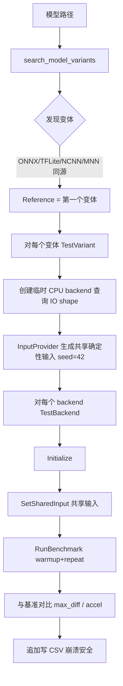

# Unified Benchmark Tool v2.0 (C++)

跨平台多框架推理基准测试工具，覆盖 **ONNX Runtime / TensorFlow Lite / LiteRT / NCNN / MNN** 五大框架，支持 **CPU / GPU / NPU / DSP** 多种加速后端。同一模型（从同一 ONNX 转换）在多个后端上运行，使用**共享确定性输入**对比推理延迟与输出精度。

> **目的**：尽可能真实地测试每一种 backend 的推理能力——不支持的 backend 直接报错标记失败（`avg=0.0ms, accel=-1.00x`），绝不静默降级。

---

## 1. 目录结构

```
unified_model_bench/
├── CMakeLists.txt              # 主构建脚本（VS / NDK / Ninja 通用）
├── include/                    # 公共头文件
│   ├── backend_interface.hpp   # IBackend 抽象接口 + BackendId/BackendType 枚举 + Registry
│   ├── benchmark_runner.hpp    # 基准测试编排
│   ├── cmd_args.hpp            # CLI 参数结构
│   ├── model_format.hpp        # 模型格式枚举（ONNX/TFLite/NCNN/MNN）
│   ├── platform.hpp            # 平台宏（ARCH_STR 等）
│   └── ...                     # log / input_provider / result_collector 等
├── src/                        # 实现
│   ├── main.cpp                # 入口
│   ├── benchmark_runner.cpp    # 编排：模型发现 → 输入生成 → 逐 backend 测试 → CSV
│   ├── backend_registry.cpp    # 各平台 backend 注册表
│   ├── onnx_backend.cpp        # ONNX Runtime EP（DML/OpenVINO/oneDNN/QNN/NNAPI/XNNPACK）
│   ├── tflite_backend.cpp      # TFLite Delegate（XNNPACK/NNAPI/GPU/QNN-NPU）
│   ├── litert_backend.cpp      # LiteRT（CPU/GPU/NPU，QNN dispatch）
│   ├── litert_qualcomm_stubs.cpp # Android 专用：QNN options API 的 stub 实现
│   ├── ncnn_backend.cpp        # NCNN（CPU/Vulkan，FP32/FP16/BF16）
│   ├── mnn_backend.cpp         # MNN（CPU/OpenCL/Vulkan）
│   └── ...                     # cmd_args / device_info / file_ops / input_provider / result_collector / log
├── deps/                       # 第三方依赖（离线 vendored）
│   ├── onnxruntime/            # ORT 1.22.0 + DML/OpenVINO/oneDNN/QNN 各 EP 变体
│   ├── tflite/                 # TFLite 2.18.0（include + 各平台 .so/.dll）
│   ├── litert/                 # LiteRT runtime + litert_cc_sdk + NPU dispatch 库
│   ├── ncnn/                   # NCNN（桌面 + Android 头文件/库）
│   └── mnn/                    # MNN
├── tools/                      # 构建与转换脚本
│   ├── NDK_build_Android_auto.bat  # Android NDK 构建 + adb 部署 + 自动推 QNN/NCNN/TFLite/MNN/LiteRT 库
│   ├── VS_build_win_x64.bat        # Windows x64 VS 构建
│   ├── VS_build_win_x86.bat        # Windows x86 VS 构建
│   ├── onnx_convert.py             # ONNX → TFLite/NCNN/MNN 转换
│   ├── gen_test_model.py           # 生成测试模型
│   └── csv_to_excel.py             # CSV → Excel
├── docs/                       # 各模块调试记录（详见 §8）
│   ├── ONNX_DEBUG_LOG.md
│   ├── TFLITE_NPU_DEBUG_LOG.md
│   ├── NCNN_DEBUG_LOG.md
│   └── LiteRT_GPU_DEBUG_LOG.md
└── summary.csv                 # 历史测试结果（追加式）
```

---

## 2. 支持的后端矩阵

### 2.1 BackendId 编号规则

| 范围 | 框架 | 说明 |
|------|------|------|
| 0–17 | ONNX | Execution Provider |
| 100–107 | TFLite | Delegate |
| 200–206 | NCNN | CPU/Vulkan |
| 300–309 | MNN | CPU/OpenCL/Vulkan |
| 400–405 | LiteRT | CPU/GPU/NPU |

### 2.2 各框架后端

**ONNX Runtime（0–17）**

| Backend | 名称 | 桌面 | Android | 说明 |
|---------|------|------|---------|------|
| ONNX_CPU | `ONNX_CPU` | ✅ | ✅ | 默认 CPU EP（基准） |
| ONNX_ONEDNN | `ONNX_oneDNN` | ✅ | ❌ | Intel oneDNN |
| ONNX_DML_GPU | `ONNX_DML_GPU` | ✅ | ❌ | DirectML GPU |
| ONNX_DML_GPU_FP16 | `ONNX_DML_GPU_FP16` | ✅ | ❌ | DML FP16 |
| ONNX_DML_NPU | `ONNX_DML_NPU` | ✅ | ❌ | DirectML NPU（V2 API） |
| ONNX_OPENVINO_CPU | `ONNX_OpenVINO_CPU` | ✅ | ❌ | OpenVINO CPU |
| ONNX_OPENVINO_GPU | `ONNX_OpenVINO_GPU` | ✅ | ❌ | OpenVINO GPU FP32 |
| ONNX_OPENVINO_GPU_FP16 | `ONNX_OpenVINO_GPU_FP16` | ✅ | ❌ | OpenVINO GPU FP16 |
| ONNX_OPENVINO_NPU | `ONNX_OpenVINO_NPU` | ✅ | ❌ | OpenVINO NPU |
| ONNX_NNAPI | `ONNX_NNAPI` | ❌ | ✅ | Android NNAPI |
| ONNX_XNNPACK | `ONNX_XNNPACK` | ❌ | ✅ | XNNPACK EP |
| ONNX_QNN_CPU / _GPU / _HTP | `ONNX_QNN_*` | ❌ | ✅ | Qualcomm QNN |

> **已删除**：`ONNX_OpenVINO_GPU_BF16`（id=8）——OpenVINO GPU 只支持 FP16/FP32/ACCURACY，BF16 在框架层面无此能力，所有硬件均不支持，故移除。

**TFLite（100–107）**

| Backend | 名称 | 桌面 | Android | 说明 |
|---------|------|------|---------|------|
| TFLITE_CPU | `TFLITE_CPU` | ✅ | ✅ | 默认（基准） |
| TFLITE_XNNPACK | `TFLITE_XNNPACK` | ✅ | ✅ | XNNPACK delegate |
| TFLITE_XNNPACK_FP16 | `TFLITE_XNNPACK_FP16` | ✅* | ✅ | FP16（桌面需硬件支持） |
| TFLITE_NNAPI | `TFLITE_NNAPI` | ❌ | ✅ | NNAPI |
| TFLITE_GPU / _FP16 | `TFLITE_GPU` | ❌ | ✅ | GPU delegate |
| TFLITE_NPU | `TFLITE_NPU` | ❌ | ✅ | QNN HTP delegate |

**LiteRT（400–405）**

| Backend | 名称 | 桌面 | Android | 说明 |
|---------|------|------|---------|------|
| LITERT_CPU | `LiteRT_CPU` | ✅ | ✅ | LiteRT CPU（基准） |
| LITERT_GPU | `LiteRT_GPU` | ✅ | ✅ | WebGPU/D3D12（桌面）/ CL/GL（Android） |
| LITERT_GPU_FP16 | `LiteRT_GPU_FP16` | ✅ | ✅ | GPU FP16 |
| LITERT_NPU | `LiteRT_NPU` | ❌ | ✅ | Qualcomm HTP（dispatch） |
| LITERT_NPU_FP16 | `LiteRT_NPU_FP16` | ❌ | ✅ | HTP FP16 |

**NCNN（200–206）**

| Backend | 名称 | 桌面 | Android | 说明 |
|---------|------|------|---------|------|
| NCNN_CPU | `NCNN_CPU` | ✅ | ✅ | CPU（基准） |
| NCNN_CPU_FP16 | `NCNN_CPU_FP16` | ✅ | ✅ | CPU FP16（NEON） |
| NCNN_CPU_BF16 | `NCNN_CPU_BF16` | ✅* | ✅* | CPU BF16（需 CPUID 支持 + trial 验证） |
| NCNN_VK / _FP16 / _BF16 | `NCNN_Vulkan*` | ✅ | ❌* | Vulkan（Android NCNN 编译时无 Vulkan，报错不降级） |

**MNN（300–309）**：CPU / OpenCL / Vulkan / OpenGL，桌面与 Android 均支持（桌面默认关闭 `HAVE_MNN_BACKEND=OFF`）。

---

## 3. 构建系统

### 3.1 依赖与版本

| 依赖 | 版本 | 桌面路径 | Android 路径 |
|------|------|----------|--------------|
| ONNX Runtime | 1.22.0 | `deps/onnxruntime/lib/win-x64/{cpu,dml,onednn,openvino}/` | `deps/onnxruntime/lib/android/arm64-v8a/` |
| TensorFlow Lite | 2.18.0 | `deps/tflite/lib/win-x64/tensorflowlite_c.dll` | `deps/tflite/lib/android/arm64-v8a/*.so` |
| LiteRT | — | `deps/litert/liteRT_runtime/windows_x86_64/` | `deps/litert/liteRT_runtime/android_arm64/` |
| NCNN | 1.0.x | `deps/ncnn/lib/win-x64/ncnn.dll` | `deps/ncnn/lib/android/arm64-v8a/libncnn.so` |
| MNN | — | `deps/mnn/lib/win-x64/MNN.dll` | `deps/mnn/lib/arm64-v8a/libMNN.so` |
| QNN SDK | 2.48.40.260702 | — | `C:\Qualcomm\AIStack\QAIRT\2.48.40.260702` |

### 3.2 CMake 选项

| 选项 | 默认 | 说明 |
|------|------|------|
| `HAVE_ONNX_BACKEND` | ON | ONNX Runtime |
| `HAVE_TFLITE_BACKEND` | OFF | TFLite |
| `HAVE_NCNN_BACKEND` | ON | NCNN |
| `HAVE_MNN_BACKEND` | OFF | MNN |
| `HAVE_LITERT_BACKEND` | OFF | LiteRT |
| `QNN_SDK_ROOT` | — | QNN SDK 路径（Android） |

### 3.3 Windows x64 构建

```bat
tools\VS_build_win_x64.bat
:: 或手动：
cmake -B build/win-x64 -DHAVE_TFLITE_BACKEND=ON -DHAVE_LITERT_BACKEND=ON -DHAVE_ONNX_BACKEND=ON -DHAVE_NCNN_BACKEND=ON
cmake --build build/win-x64 --config Debug
```

### 3.4 Android NDK 构建 + 部署

```bat
set ANDROID_NDK_ROOT=C:\Users\...\Android\Sdk\ndk\27.0.12077973
tools\NDK_build_Android_auto.bat
```

脚本自动完成：配置 → 编译 → `adb push` 可执行文件与全部 `.so` → 按 `ro.soc.model` 自动选 Hexagon 版本并推送 Stub/Skel → 运行基准 → 回拉 CSV。

---

## 4. CLI 用法

```
unified_bench <model_path> [选项]

选项：
  --model <path>       模型路径（也支持位置参数）
  --backend <name,...> 指定 backend（逗号分隔，缺省=全部可用）
  --repeat <N>         推理次数（默认 100）
  --warmup <N>         预热次数（默认 1）
  --threads <N>        线程数（默认 4）
  --csv <path>         CSV 输出路径（默认 summary.csv）
  --log-level <0-4>    日志级别（0=OFF..4=ERR，默认 2=INFO）
  --input <path>       外部输入
  --output-dir <path>  输出目录
  --save-input         保存输入
  --no-save-output     不保存输出
  --no-csv             不写 CSV
  --no-output-print    不打印输出
  --help / --version
```

### 示例

```bash
# 桌面：全后端
unified_bench.exe test_model.onnx --repeat 10 --warmup 1

# 桌面：指定 TFLite 后端
unified_bench.exe test_model.tflite --backend TFLITE_CPU,TFLITE_XNNPACK --repeat 10

# Android：QNN HTP（ONNX）与 TFLite NPU 对比
adb shell "cd /data/local/tmp/bench_test && LD_LIBRARY_PATH=.:./qnn ADSP_LIBRARY_PATH=./qnn \
  ./unified_bench test_model.onnx --backend ONNX_QNN_HTP,TFLITE_NPU --repeat 10"

# Android：LiteRT NPU
adb shell "cd /data/local/tmp/bench_test && LD_LIBRARY_PATH=.:./qnn ADSP_LIBRARY_PATH=./qnn \
  ./unified_bench test_model.onnx --backend litert_npu --repeat 1 --warmup 0"
```

### backend 命名（不区分大小写）

`ONNX_CPU`, `ONNX_DML_GPU`, `ONNX_OpenVINO_GPU_FP16`, `ONNX_QNN_Htp`, `TFLITE_XNNPACK`, `TFLITE_NPU`, `LiteRT_CPU`, `LiteRT_GPU`, `LiteRT_NPU`, `NCNN_CPU`, `NCNN_Vulkan`, `NCNN_CPU_BF16`, `MNN_OpenCL` 等。

---

## 5. 架构设计

### 5.1 核心流程（`benchmark_runner.cpp`）



### 5.2 后端抽象（`backend_interface.hpp`）

所有 backend 实现同一 `IBackend` 接口，通过 `BackendRegistry` 注册与工厂创建：

```
IBackend
├── Initialize(model_path, num_threads)
├── QueryIOInfo(input_shape, output_shape)
├── SetSharedInput / PrepareInputs
├── RunBenchmark(warmup, repeat, ...)
├── GetTiming(...)
└── SaveOutputs(...)
```

### 5.3 共享输入机制

- 所有 backend 使用**同一份确定性输入**（`InputProvider`，seed=42）保证公平对比
- 临时 CPU backend 先查询模型 IO shape → 解析成元素个数 → 生成输入
- 各 backend 内部处理自己的布局需求（TFLite NCHW→NHWC 转置、NCNN [N,C,H,W]→[w,h,c] 等）

### 5.4 失败语义

- **初始化失败**（如 backend 不可用、精度不支持）→ 记录 `avg=0.0ms, accel=-1.00x` 到 CSV，不崩溃
- **不支持即报错**，绝不静默降级（NCNN BF16 无指令 → 报错；Vulkan 无设备 → 报错；FP16 权重缺失 → 报错）
- 通过 `last_error_` 携带具体失败原因写入 CSV `notes` 列

---

## 6. 关键平台适配（踩坑记录摘要）

### 6.1 Windows：TFLite + LiteRT 共存（2026-07-21 解决）

**问题**：`libLiteRt.dll` 与 `tensorflowlite_c.dll` 都导出完整 TFLite C API（21 个 `TfLite*` 符号）。linker 解析到 `libLiteRt.dll` 的 XNNPACK 实现，其在 Intel Iris Xe 上初始化时 `0xC0000005` 访问违规崩溃。

**方案**：
1. Windows 上**不链接** `tensorflowlite_c.dll.if.lib`（避免符号冲突），基础 TFLite 函数取自 `libLiteRt.lib`（验证正常）
2. **仅 XNNPACK delegate** 通过 `LoadLibrary("tensorflowlite_c.dll")` + `GetProcAddress` 动态加载（避免 `libLiteRt` 的 buggy 副本）
3. CMake 中两者可同时 `ON`，运行互不冲突

**验证**：TFLITE_CPU 29.6ms / TFLITE_XNNPACK 17.2ms / LiteRT_CPU 37.9ms 同时运行正常。

### 6.2 Android：NCNN Vulkan 宏冲突（2026-07-21 解决）

**问题**：`ncnn/platform.h` 定义 `#define NCNN_VULKAN 0`（Android 无 Vulkan），与 `BackendId::NCNN_VULKAN` 枚举名冲突，导致编译错误。

**方案**：枚举改名 `NCNN_VULKAN → NCNN_VK`（`NCNN_VK` / `NCNN_VK_FP16` / `NCNN_VK_BF16`），保留 `NCNN_VULKAN` 宏用于 `#if` 平台检测。Android 无 Vulkan 时初始化报错而非降级。

### 6.3 Android：NCNN BF16 / FP16 硬失败（2026-07-21）

- CPU BF16：无 `AVX512-BF16`/`ARM-BF16` 指令 → 直接 `return false`（不再 fallback FP32）
- CPU BF16：trial 前向崩溃 → `return false`
- Vulkan BF16：GPU 不支持 → `return false`
- Vulkan FP16：`_fp16.ncnn.bin` 权重缺失 → `return false`

### 6.4 Windows：LiteRT GPU 需要新版 DXC（2026-07-21）

`libLiteRtWebGpuAccelerator.dll` 运行时 `LoadLibrary` 加载 `dxcompiler.dll`，旧版（10.0.19041）无 Dawn 需要的 CLSID → `E_NOINTERFACE`。CMake post-build 自动搜索 Windows SDK 最新 `dxcompiler.dll`/`dxil.dll` 复制到输出目录。

### 6.5 Android：QNN 版本严格匹配

| 场景 | 版本要求 |
|------|----------|
| TFLITE_NPU（QNN TFLite Delegate） | Stub（aarch64-android）与 Skel（hexagon）必须同 SDK，否则 DSP 固件加载失败 error 1008 |
| ONNX_QNN（QNN EP） | `libonnxruntime.so` 必须是含 QNN EP 的定制构建 |
| LiteRT_NPU（dispatch） | dispatch 编译时的 QNN 版本需与设备库匹配（2.36.x vs 2.37.x 会导致 504） |

---

## 7. QNN 集成细节

### 7.1 TFLITE_NPU（QNN TFLite Delegate）

- 通过 `dlopen("libQnnTFLiteDelegate.so")` 动态加载（**无需 LD_PRELOAD**）
- `backend_type` 必须显式设 `kHtpBackend`（默认是 `kUndefinedBackend`）
- ARM64 上通过 dlsym 调用返回 struct 的函数，须声明为 >16 字节（触发 hidden-pointer ABI，x8 传递）
- 详见 `docs/TFLITE_NPU_DEBUG_LOG.md`

### 7.2 LiteRT_NPU（Qualcomm dispatch）

- `LiteRtCreateEnvironment` 传 `kLiteRtEnvOptionTagDispatchLibraryDir` = `/data/local/tmp/bench_test/qnn`
- 需配置 `LrtQualcommOptions`（backend=HTP、performance=burst、optimization=O3）并 attach 到编译选项，否则 dispatch 报 "Null Qualcomm options"
- Android `libLiteRt.so` 不导出 `Lrt*QualcommOptions*` API → 由 `litert_qualcomm_stubs.cpp` 提供 stub（序列化为 TOML payload）
- **已知问题**：设备上 QNN 库（2.37.0/5.48.0）与 dispatch 期望（2.36.0/5.47.0）不匹配时 `CreateCompiledModel` 返回 **504**，需匹配版本的 QNN 库

### 7.3 ONNX QNN EP

- 使用含 QNN EP 的定制 `libonnxruntime.so`（`deps/onnxruntime/lib/android/qnn/`）
- HTP 完整配置：`backend_type=htp`、`htp_performance_mode=burst`、`htp_graph_finalization_optimization_mode=3`、`enable_htp_fp16_precision=1` 等
- 支持 EP Context 缓存：首次编译生成 `*_epContext.onnx`，后续复用（`kOrtSessionOptionsDisableModelCompile`）

### 7.4 设备端 QNN 目录布局

```
/data/local/tmp/bench_test/qnn/
├── libQnnTFLiteDelegate.so      # TFLite NPU delegate
├── libLiteRtDispatch_Qualcomm.so # LiteRT NPU dispatch（SoC 对应版本）
├── libQnnHtp.so / libQnnSystem.so / libQnnHtpPrepare.so / libQnnSaver.so / libQnnCpu.so / libQnnGpu.so
├── libQnnHtpV73Stub.so / CalculatorStub.so   # 必须与 Skel 同 SDK
├── libQnnHtpV73Skel.so          # Hexagon DSP 固件（与 Stub 同 SDK）
├── libc++.so.1 / libc++abi.so.1 # Hexagon C++ 运行时（v73/G0/pic）
└── (qtld-net-run)               # QNN 官方验证工具
```

---

## 8. 调试文档索引

| 文档 | 内容 |
|------|------|
| `docs/ONNX_DEBUG_LOG.md` | ORT_API_VERSION 运行时解析、DML/OpenVINO 各 EP 配置 |
| `docs/TFLITE_NPU_DEBUG_LOG.md` | QNN TFLite Delegate 全链路（dlopen、struct ABI、版本匹配）+ 桌面 XNNPACK 崩溃与 TFLite/LiteRT 共存方案 |
| `docs/NCNN_DEBUG_LOG.md` | NaN（clone + packing）、BF16 崩溃（buf_pool）、版本输出、BF16 检测 |
| `docs/LiteRT_GPU_DEBUG_LOG.md` | DXC 版本过旧导致 D3D12 shader 编译失败 |

---

## 9. 已知问题 / 待办

| 项目 | 状态 | 说明 |
|------|------|------|
| LiteRT_NPU `CreateCompiledModel` 504 | 🔄 待解决 | QNN 库版本（2.37/5.48）与 dispatch 期望（2.36/5.47）不匹配；需匹配版本的 QNN 库或新版 dispatch |
| ONNX QNN HTP Android 构建 | 🔄 待解决 | 需 QNN 专用 ORT 构建（onnxruntime-qnn，受 pip/uv 镜像限制） |
| Android NCNN Vulkan | ⬜ 不可用 | Android NCNN 库编译时未启用 Vulkan（NCNN_VULKAN=0），Vulkan backend 报错不降级 |
| 桌面 TFLITE_XNNPACK_FP16 | ⚠️ 条件可用 | 依赖 FP16 硬件（Intel Iris Xe 支持） |
| MNN 桌面 | ⚠️ 默认关闭 | `HAVE_MNN_BACKEND=OFF`，需显式开启 |
